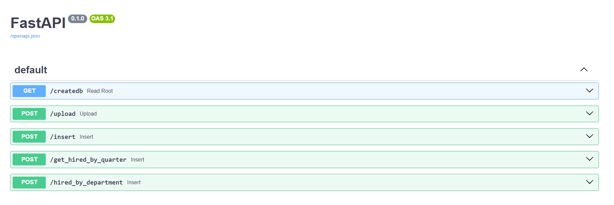

# FastAPI Application with SQLite

This is a FastAPI application that uses SQLite as its database. The application provides endpoints for creating a SQLite database, uploading CSV files to create or replace tables, inserting data into tables, and performing specific queries.

## Prerequisites

Before running the application, ensure that you have the following installed:

- Python 3.7 or higher
- [Docker](https://www.docker.com/) (optional)

## Installation

1. **Clone the Repository:**

    ```bash
    git clone https://github.com/manuelpt49/ChallengeDataGL.git
    cd your-repository

2. **Install Dependencies:**

    ```bash
    pip install -r requirements.txt

## Running the Application
### Option 1: Run Locally

    
    ```bash
    uvicorn main:app --reload

### Option 2: Run with Docker
1. **Build the image**
    
    ```bash
    docker build -t myimage .

2. **Run the image**
    
    ```bash
    docker run -d --name mycontainer -p 8000:8000 myimage

## Endpoints
1. GET /createdb: Create SQLite database and tables.
2. POST /upload: Upload CSV files to create or replace tables. This endpoint receives a parameter *Table*. To upload a file in Employee table, you must set "employees". For Job - "jobs" and for Department - "departments". Otherwise, loading the data won't be successful. Also, this endpoint receives the CSV file with the data you want to load.
3. POST /insert: Insert data from the CSV file into tables. This endpoint has been configured only to allow batches of 1 to 1000 rows in CSV files. The parameters required in this endpoint are the same as mentioned in the /upload endpoint.
4. POST /get_hired_by_quarter: Get a summary of all hired people by quarter, jobs, and department. This endpoint receives a parameter of the year you want to calculate the summary.
5. POST /hired_by_department: Get a summary of all hired people by departments that exceed the average of hired people. This endpoint receives a parameter of the year you want to calculate the summary.



For testing purposes of endpoints, when you execute the application, enter to the route /docs and you will be able to test them.
